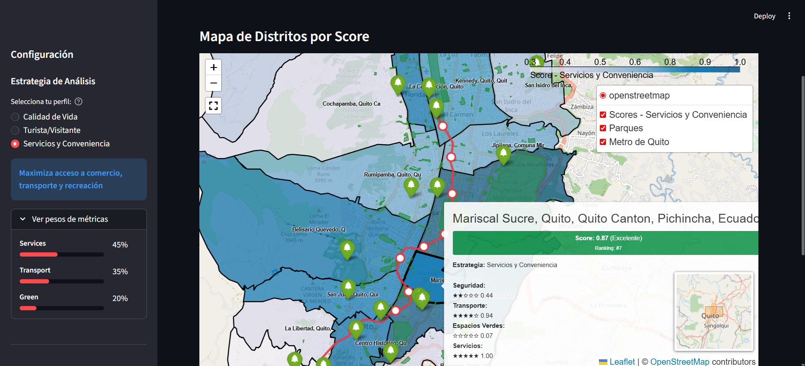
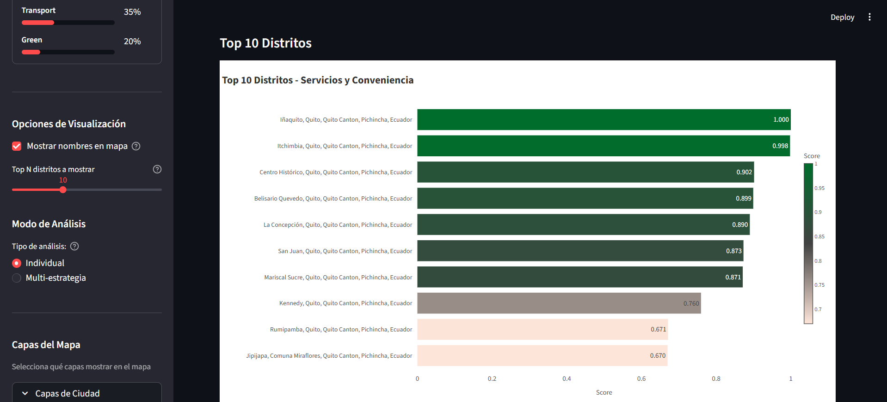
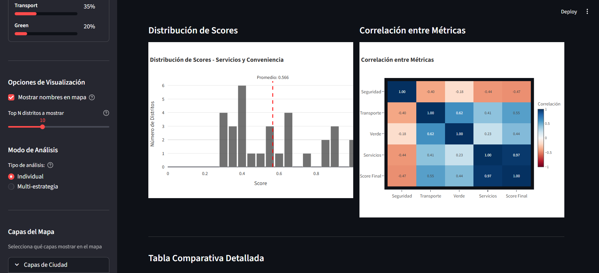
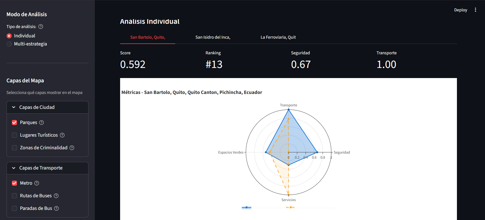
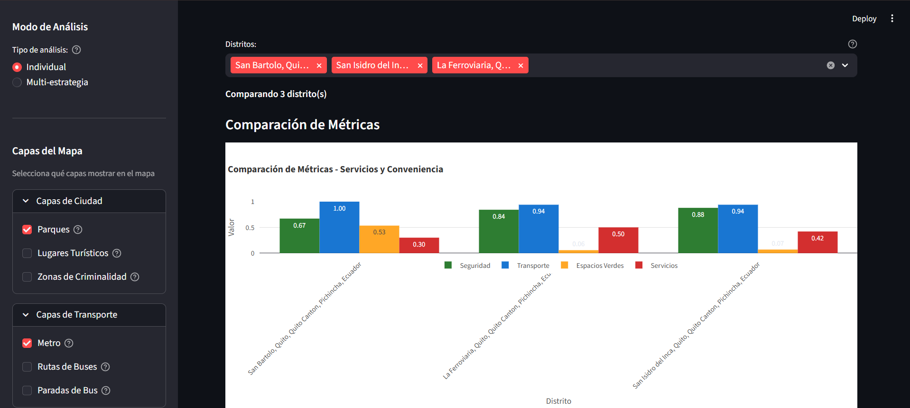
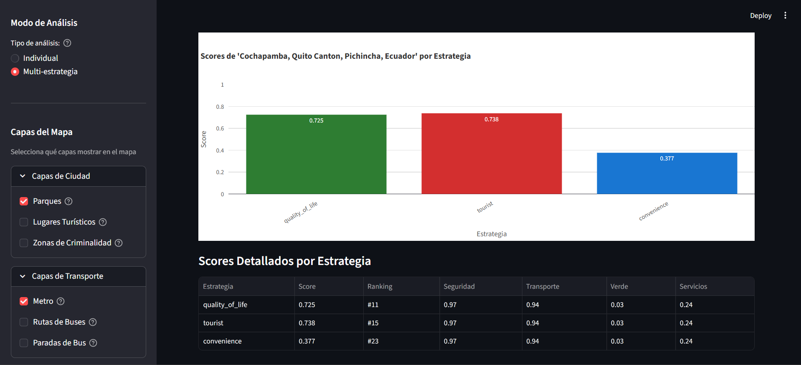

# GeonsitQ - Urban Recommendation System


## Overview

GeonsitQ is an intelligent urban recommendation system that leverages geospatial data and advanced analytical strategies to provide personalized location-based suggestions within a city, in this case for Quito, Ecuador. 

The system integrates multiple data sources including transportation networks (metro and bus systems), crime statistics, parks, and tourist attractions to generate comprehensive city maps and recommend optimal locations based on user-defined criteria. It employs sophisticated design patterns and factory methodologies to ensure extensibility, maintainability, and the ability to adapt to different analytical strategies. 

The application provides an interactive Streamlit-based interface where users can visualize geospatial layers, compare different urban areas, view statistical rankings, and analyze city metrics through an intuitive dashboard.

> *Disclaimer: The shapefiles used in this project come from the public geoportal of the Municipality of Quito. The distribution of districts, parks, and tourist sites comes from OSM.*

## Demo

<table>
	<tr>
		<td style="padding: 10px;"></td>
		<td style="padding: 10px;"></td>
	</tr>
	<tr>
		<td style="padding: 10px;"></td>
		<td style="padding: 10px;"></td>
	</tr>
	<tr>
		<td style="padding: 10px;"></td>
		<td style="padding: 10px;"></td>
	</tr>
</table>

## Design Patterns Implemented

For a visual representation of the design patterns implemented in this system, refer to the [Design Patterns Diagrams](pics/DesignPatternsDiagrams.png).

### 1. **Singleton Pattern**
Located in [src/mapq.py](src/mapq.py), the `CityGraph` class implements the Singleton pattern to ensure only one instance of the city graph exists throughout the application lifecycle. This guarantees a single, shared source of truth for loading and managing district data, parks, tourist places, and the city's geographic information, preventing redundant data loads and ensuring consistency across the system.

### 2. **Abstract Factory Pattern**
The [src/folium_integration/](src/folium_integration/) module uses the Abstract Factory pattern to create families of related transport system objects (Metro and Bus systems). The abstract factory defines common interfaces for creating transport maps and layers, allowing the system to switch between different transport implementations without modifying client code. This pattern ensures that metro and bus transport layers are created consistently and can be extended with new transport types.

### 3. **Factory Method Pattern**
Implemented across [src/factories/](src/factories/), this pattern provides multiple factory classes (`DistrictLayerFactory`, `ParksLayerFactory`, `TouristPlaceLayerFactory`, `CrimesLayerFactory`) that create different types of geographic layers. Each factory encapsulates the creation logic for specific layer types, allowing the system to dynamically instantiate different layers based on user requirements without coupling the creation logic to client code.

### 4. **Adapter Pattern**
Found in [src/factories/adapters/](src/factories/adapters/), this pattern adapts incompatible data sources and formats to work seamlessly with the system. The adapters translate diverse geographic data sources, shapefile formats, and crime statistics into a unified interface that the mapping system can consume, enabling integration of heterogeneous data sources without modifying the core mapping logic.

### 5. **Facade Pattern**
Implemented in [src/folium_integration/city_integration.py](src/folium_integration/city_integration.py), the `CityTransportIntegration` facade provides a simplified interface for managing multiple transport systems and adding their layers to the map. It abstracts the complexity of coordinating multiple transport factories and layer management, presenting a unified, easy-to-use API for the rest of the application.

### 6. **Observer Pattern**
Implemented in [src/observers/](src/observers/), this pattern enables loosely-coupled event-driven architecture where observers respond to changes in map state, caching events, and recommendations. The `CacheObserver` and `RecommendationObserver` classes monitor changes to the `MapState` and trigger appropriate actions, allowing multiple components to react to state changes without direct dependencies.

### 7. **Strategy Pattern**
Found in [src/strategies/](src/strategies/), this pattern defines a family of interchangeable algorithms for location recommendation. The `BaseStrategy` abstract class allows different strategies (`ConvenienceStrategy`, `QOLStrategy`, `TouristStrategy`) to encapsulate alternative calculation methods, enabling runtime selection of different recommendation algorithms. The `StrategyFactory` manages strategy instantiation, allowing users to switch between different location evaluation approaches dynamically.

## Installation & Setup

### Prerequisites
- Python 3.8 or higher
- Virtual environment tool (venv)

### Step 1: Create Virtual Environment

**On Linux/macOS:**
```bash
python3 -m venv env
source env/bin/activate
```

**On Windows:**
```cmd
python -m venv env
env\Scripts\activate
```

### Step 2: Install Dependencies

```bash
pip install -r requirements.txt
```

### Step 3: Configure Environment Variables

Create a `.env` file in the project root by copying the template:

**Linux/macOS:**
```bash
cp .env.template .env
```

**Windows:**
```cmd
copy .env.template .env
```

Then edit the `.env` file with your specific configuration:
- `CITY`: Your city name
- `COUNTRY`: Your country name
- `DISTRICTS`: JSON array of district names to analyze
- `SHP_METRO`: Path to metro lines shapefile
- `SHP_METRO_STATIONS`: Path to metro stations shapefile
- `SHP_BUS_ROUTES`: Path to bus routes shapefile
- `SHP_BUS_STOPS`: Path to bus stops shapefile
- `SHP_CRIMES`: Path to crime data shapefile

### Step 4: Run the Application

```bash
streamlit run app.py
```

The application will launch at `http://localhost:8501` in your default browser.

## Testing

### Unit Tests

**Linux/macOS:**
```bash
bash scripts/unix/run_unit_tests.sh
```

**Windows:**
```cmd
scripts\windows\run_unit_tests.bat
```

### Integration Tests

**Linux/macOS:**
```bash
bash scripts/unix/run_integration_tests.sh
```

**Windows:**
```cmd
scripts\windows\run_integration_tests.bat
```

### Full Test Suite with Coverage

The test scripts automatically generate HTML and terminal coverage reports. After running any test script, the coverage report will be available in the `htmlcov/` directory. Open `htmlcov/index.html` in your browser to view detailed coverage statistics.

### Test Configuration

The test suite uses pytest with the following configuration (see [tests/pytest.ini](tests/pytest.ini)):
- Coverage minimum threshold: 70%
- Test discovery: `test_*.py` pattern
- HTML and terminal coverage reports
- Verbose output with short traceback format
- Virtual environment auto-activation in test scripts
